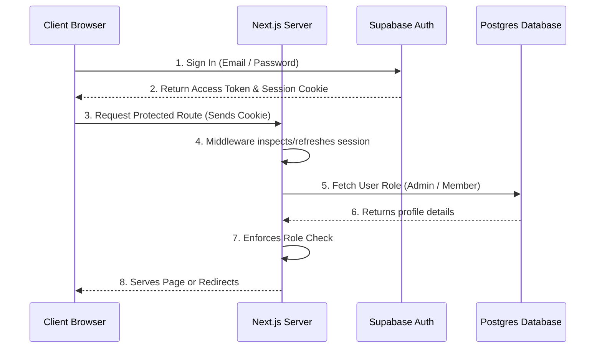

# Authentication and Authorization Flow

This document details the authentication and authorization (RBAC) architecture for the Attendance Tracker application.

---

## Overview

We use **Supabase Auth** for user identity management combined with a custom database profile table (`users`) to manage authorization.

---

## 1. Sign Up Flow

1. **Client Registration**: The user registers on the client-side using `supabase.auth.signUp()`.
2. **Auth Record**: Supabase creates a record in the `auth.users` table.
3. **Database Profile Trigger**: 
   * When a user is created in `auth.users`, a database trigger (or service registration helper) inserts a corresponding profile row into the `public.users` table.
   * By default, the `role` is set to `'member'::user_role`.
   * The `id` in the `public.users` table is mapped directly to the `auth.users.id` (foreign key relationship).

---

## 2. Sign In & Session persistence

1. **Credentials Entry**: The user signs in via email/password using `supabase.auth.signInWithPassword()`.
2. **Session Generation**: Supabase issues a JWT access token and refresh token.
3. **Cookie Storage**: The client-side library stores these credentials in browser cookies.
4. **Middleware Refresh**: 
   * On every request, Next.js root middleware (`src/middleware.ts`) runs `updateSession()` from `src/lib/supabase/middleware.ts`.
   * This refreshes the session cookie automatically if it has expired.

---

## 3. Authorization Flow

Authorization is enforced at two levels:

### 1. API Service Layer
Before completing sensitive actions (like modifying a meeting), service layer functions check the user's role:
* They query `getCurrentUser()` to retrieve the logged-in profile.
* They verify whether `role` matches the required privilege level (e.g. `role === 'admin'`).

### 2. Row Level Security (RLS)
The database enforces security rules directly at the SQL level, ensuring that if a user bypasses client verification, they cannot write or read unauthorized database rows.
* Policies verify `auth.uid() = user_id` for individual records.
* Policies use `public.is_admin()` helper function to permit full actions to admin members.

---

## 4. Permissions Matrix

| Resource | Operation | Member Permission | Admin Permission | RLS Constraint |
| :--- | :--- | :---: | :---: | :--- |
| **Profile (`users`)** | View | Yes | Yes | `auth.uid() = id` OR `is_admin()` |
| | Edit | Yes (own name) | Yes (all) | `auth.uid() = id` OR `is_admin()` |
| | Change Role | **No** | **Yes** | Bypasses RLS only via Service Role |
| **Meetings (`meetings`)** | View | Yes | Yes | `auth.role() = 'authenticated'` |
| | Create/Edit/Delete | **No** | **Yes** | `is_admin()` |
| **Attendance (`attendance`)**| Scan/Mark Self | Yes | Yes | `auth.uid() = user_id` OR `is_admin()` |
| | View Self | Yes | Yes | `auth.uid() = user_id` OR `is_admin()` |
| | View All | **No** | **Yes** | `is_admin()` |
| | Modify All | **No** | **Yes** | `is_admin()` |
| **Events (`events`)** | View | Yes | Yes | `auth.role() = 'authenticated'` |
| | Create/Edit/Delete | **No** | **Yes** | `is_admin()` |
| **Volunteers** | Register Self | Yes | Yes | `auth.uid() = user_id` OR `is_admin()` |
| | View Roster | Yes | Yes | `auth.role() = 'authenticated'` |
| | Manage Roster | **No** | **Yes** | `is_admin()` |
