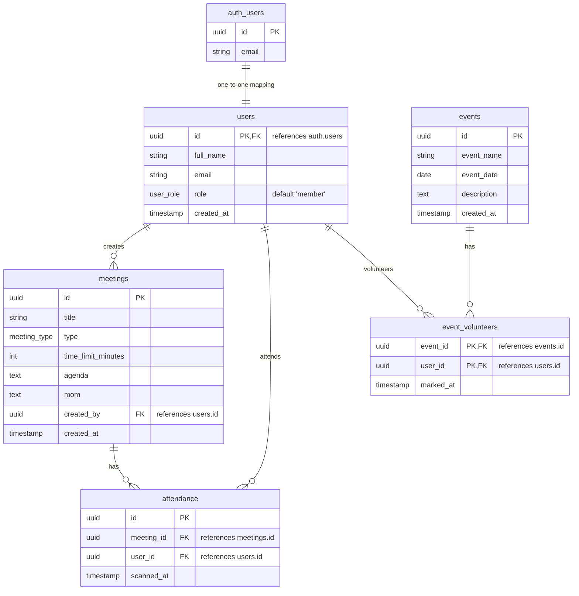

# Database Schema Documentation

This document describes the database schema of the Attendance Tracker application. The schema is hosted in Supabase (PostgreSQL) and contains tables for managing users, meetings, attendance, events, and event volunteers.

## Entity Relationship Diagram (ERD)

---

## Enum Definitions

### `user_role`
Represents the system roles assigned to users for access control.
* **Values**:
  * `admin`: Administrative users with full access to create meetings/events, view all attendance, and manage members.
  * `member`: Standard club members who can view their own profile/attendance, view meetings, view events, and register as volunteers.

### `meeting_type`
Categorizes the type of meetings hosted by the club.
* **Values**:
  * `Club`
  * `Technical`
  * `Creatives`
  * `Outreach`
  * `Event`
  * `Other`

---

## Table Descriptions

### `users`
Profiles for club members synced with Supabase auth users.

| Column | Type | Constraints | Description |
| :--- | :--- | :--- | :--- |
| `id` | `UUID` | `PRIMARY KEY`, `REFERENCES auth.users(id) ON DELETE CASCADE` | Matches the Supabase authenticated user's ID. |
| `full_name` | `TEXT` | `NOT NULL` | The full name of the user. |
| `email` | `TEXT` | `UNIQUE`, `NOT NULL` | The user's email address. |
| `role` | `user_role` | `DEFAULT 'member'` | The access role of the user (`admin` or `member`). |
| `created_at` | `TIMESTAMP WITH TIME ZONE` | `DEFAULT timezone('utc', now())` | Record creation timestamp. |

### `meetings`
Meetings or club sessions created by admins for which attendance needs to be tracked.

| Column | Type | Constraints | Description |
| :--- | :--- | :--- | :--- |
| `id` | `UUID` | `PRIMARY KEY`, `DEFAULT gen_random_uuid()` | Unique meeting identifier. |
| `title` | `TEXT` | `NOT NULL` | Title/name of the meeting. |
| `type` | `meeting_type` | `NOT NULL` | Category of the meeting. |
| `time_limit_minutes` | `INT` | `NOT NULL` | Duration in minutes during which the attendance QR code is active. |
| `agenda` | `TEXT` | `NULLABLE` | Meeting agenda description. |
| `mom` | `TEXT` | `NULLABLE` | Minutes of Meeting notes. |
| `created_by` | `UUID` | `REFERENCES users(id)` | Admin user who created the meeting. |
| `created_at` | `TIMESTAMP WITH TIME ZONE` | `DEFAULT timezone('utc', now())` | Record creation timestamp. |

### `attendance`
Logs showing which users attended which meetings.
* **Rule**: Attendance is determined strictly by the existence of a row in this table. If a row exists matching `meeting_id` and `user_id`, the user is **Present**. If no matching row exists, the user is **Absent**.

| Column | Type | Constraints | Description |
| :--- | :--- | :--- | :--- |
| `id` | `UUID` | `PRIMARY KEY`, `DEFAULT gen_random_uuid()` | Unique log identifier. |
| `meeting_id` | `UUID` | `REFERENCES meetings(id) ON DELETE CASCADE` | Meeting attended. |
| `user_id` | `UUID` | `REFERENCES users(id) ON DELETE CASCADE` | User who attended. |
| `scanned_at` | `TIMESTAMP WITH TIME ZONE` | `DEFAULT timezone('utc', now())` | Timestamp when the user scanned the QR code. |

* **Additional Constraints**:
  * `UNIQUE(meeting_id, user_id)`: A user can only have one attendance log per meeting.

### `events`
Events hosted by the club which users can volunteer for.

| Column | Type | Constraints | Description |
| :--- | :--- | :--- | :--- |
| `id` | `UUID` | `PRIMARY KEY`, `DEFAULT gen_random_uuid()` | Unique event identifier. |
| `event_name` | `TEXT` | `NOT NULL` | Name of the event. |
| `event_date` | `DATE` | `NOT NULL` | Date on which the event occurs. |
| `description` | `TEXT` | `NULLABLE` | Detailed description of the event. |
| `created_at` | `TIMESTAMP WITH TIME ZONE` | `DEFAULT timezone('utc', now())` | Record creation timestamp. |

### `event_volunteers`
Links members to events they are volunteering for.

| Column | Type | Constraints | Description |
| :--- | :--- | :--- | :--- |
| `event_id` | `UUID` | `REFERENCES events(id) ON DELETE CASCADE` | Event associated with. |
| `user_id` | `UUID` | `REFERENCES users(id) ON DELETE CASCADE` | User volunteering. |
| `marked_at` | `TIMESTAMP WITH TIME ZONE` | `DEFAULT timezone('utc', now())` | Timestamp when the volunteer registration occurred. |

* **Additional Constraints**:
  * `PRIMARY KEY (event_id, user_id)`: Prevents duplicate volunteer registrations.
